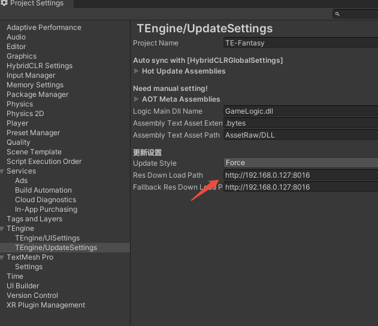
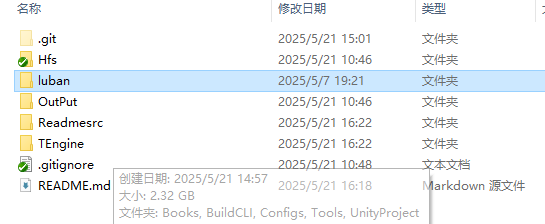
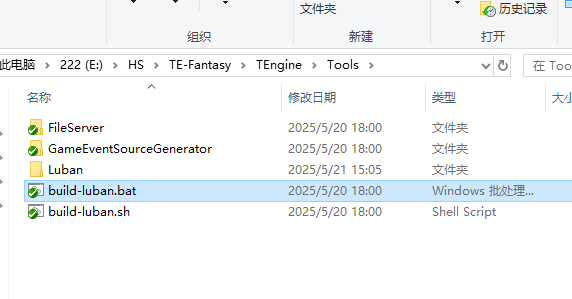
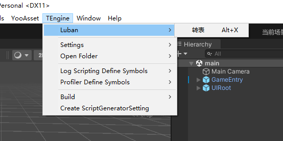
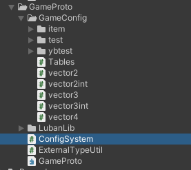
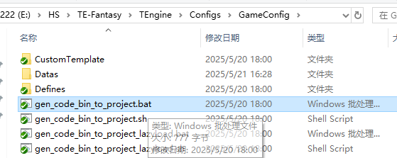
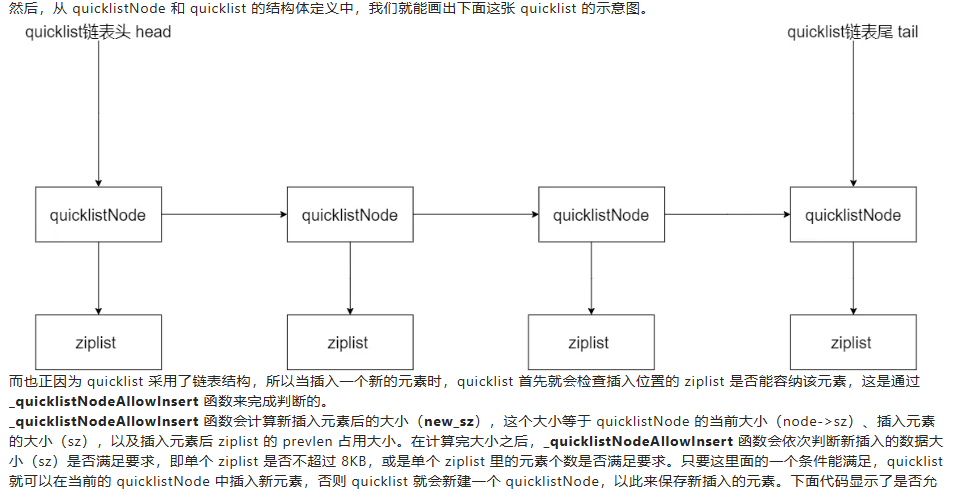
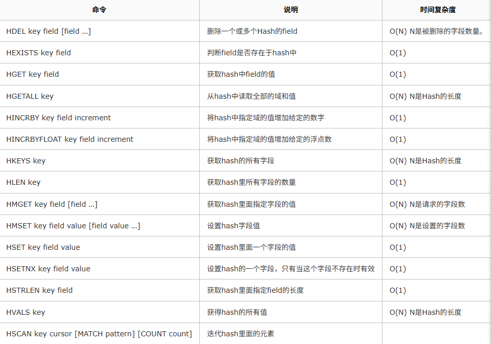

# TE-Fantasy
基于TEngine框架 游戏开发
# 说明目录 
[URL在线转换](https://www.toolhelper.cn/EncodeDecode/Url?type=1)
[大小写转换](https://app.xunjiepdf.com/yinwen)
- [快速开始使用](#%E5%BF%AB%E9%80%9F%E5%BC%80%E5%A7%8B%E4%BD%BF%E7%94%A8)  
    * [打包运行](#%E6%89%93%E5%8C%85%E8%BF%90%E8%A1%8C)
    * [注意事项](#%E6%B3%A8%E6%84%8F%E4%BA%8B%E9%A1%B9)
- [导入luban](#luban)


## 快速开始使用

### 打包运行
 *   1.运行菜单 HybridCLR/Install... 安装HybridCLR，每次更新HybridCLR版本需要重新执行一次安装。
 *   2.运行菜单 HybridCLR/Define Symbols/Enable HybridCLR 运行开启HybridCLR热更新。
 *   3.运行菜单 HybridCLR/Generate/All 进行必要的生成操作。这一步不可遗漏!!!
 *   4.运行菜单 HybridCLR/Build/BuildAssets And CopyTo AssemblyPath，生成热更新dll并copy到热更程序集中。
 *   5.运行菜单 YooAsset/AssetBundle Builder 构建AB。
 *   6.打开Build Settings对话框，点击Build And Run，打包并且运行热更新示例工程。
### 注意事项
* 打包时需要打包的模式在 main 场景 ResourceDriver 下修改模式
  

* 修改热更新服务器地址 在TEngine 下的 settings 修改


* 之后的热更新，如果修改了代码，需要进行步骤4，如果修改了ab包(资源，预制体等待)则需要进行步骤6

## LuBan
* 下载[luban](https://github.com/focus-creative-games/luban.git) 到TEngine同一目录下   


* 点击Tools下的bat文件  



* 新建表，添加表配置


* 在TEngine下转表 会在GameProto下生成文件 注意ConfigSystem现在不会生成(原因是运行的bat不一样，需要去运行图8中的bat)  




* 最后在GameApp中测试，测试代码如下
```c#
 ConfigSystem.Instance.Load();
        foreach (var item in ConfigSystem.Instance.Tables.Tb.DataMap)
        {
            Log.Debug(item.Value.Id + " |" + item.Value.Desc);
        }
```

## MySQL测试 out
1. 报错Client does not support authentication protocol requested by server; consider upgrading MySQL client 解决方法：cmd运行mysql 输入指令
`ALTER USER 'root'@'localhost' IDENTIFIED WITH mysql_native_password BY '123456';`
`FLUSH PRIVILEGES;`
2. 报错KeyNotFoundException: The given key 'utf8mb4' was not present in the dictionary. 解决方法：更换MySql.Data.dll
点击链接 [Mysql.Data.dll](https://cn.dll-files.com/mysql.data.dll.html) 重新下载驱动包，下载第三个然后解压进行替换即可

## MongoDB
1. 下载MongoDB 和 MongoDBshll [教程](https://blog.csdn.net/tell_me_why0/article/details/139521305)
2. [使用方法](https://www.runoob.com/mongodb/mongodb-dropdatabase.html)

### MongoDB主要用法
```c#
//创建数据库 use hsgamedb
//删除数据库 db.dropDatabase
//创建集合（表）db.createCollection("gameLogin")
//删除集合 db.gameLogin.drop()
//集合插入数据 db.gameLogin.insertOne({username:"hs",password:123456})
//查看数据库 show dbs
```
unity 连接mongoDB 示例在[LoginUI.cs](./TEngine/UnityProject/Assets/GameScripts/HotFix/GameLogic/UI/LoginUI/LoginUI.cs)中


## YooAsset打包问题，ab包有问题导致图片不显示，场景等物体变紫色
1. 把图片等资源删除，重新加载进来，新建换一个目录，在yooasset中设置好重新打包。
2. 场景等物体删除在重新打包

## 网络模块 没有 测

## Socket
[服务器](./GameLoginServer/ServerLearn/ServerLearn/Form1.cs)  

[客户端](./GameLoginServer/ClientTest/ClientTest/Form1.cs)

## Redis
### [示例RedisServer](./GameLoginServer/RedisServer/RedisServer/RedisServer/Form1.cs)
* Redis是单线程+多路IO复用技术
* 优点：
1. Redis 是基于内存进行的直接操作，因此读取速度非常快： 读：11w次每秒 写：8w次每秒 有效处理程序：高性能 高并发
2. 虽然Redis 是基于内存的操作，同时为了保证数据安全可靠，会定时对数据进行持久化：RDB AOF 两种持久化方式
3. 支持事务，丰富数据结构，支持多种集群操作

* 缺点：
1. 数据库容量受到物理内存的限制，不能用作海量数据的高性能读写 Redis适合的场景主要局限在较小数据量的高性能操作和运算上
``` shell
# ① 进入上传目录,解压Redis 压缩文件
tar -zxvf redis-6.2.1.tar.gz

# ② 进入解压后的Redis 文件目录: 执行 编译安装...
cd redis-6.2.1
# 	make C语言的命令对文件进行编译,如果没有C语言环境是会出错的,需要执行： make distclean 清理错误
make
# 	正常情况编译后会提示：make test 测试,可以忽略直接进行安装：
make install

# ③ 最开始上传的只是一个安装包,通过make 命令进行了安装,Linux 默认安装程序的目录是：/usr/local/bin
#	进入Linux软件安装目录,查看安装的Redis服务
cd /usr/local/bin
ls
#	Redis服务介绍：
# 	redis-benchmark:	 性能测试工具，可以在自己本子运行，看看自己本子性能如何
# 	redis-check-aof：	修复有问题的AOF文件，rdb和aof后面介绍
# 	redis-check-dump：	修复有问题的dump.rdb文件
# 	redis-sentinel：		Redis集群使用(哨兵模式)
#	redis-server：		Redis服务器启动命令
# 	redis-cli：			客户端，操作入口

# ④ 启动redis服务 /usr/local/bin 目录下执行：
redis-server
# 	可以看到Redis 服务器的：ip 端口6379
16999:C 26 Jan 2022 22:56:23.819 # oO0OoO0OoO0Oo Redis is starting oO0OoO0OoO0Oo
16999:C 26 Jan 2022 22:56:23.819 # Redis version=6.2.1, bits=64, commit=00000000, modified=0, pid=16999, just started
16999:C 26 Jan 2022 22:56:23.819 # Warning: no config file specified, using the default config. In order to specify a config file use redis-server /path/to/redis.conf
16999:M 26 Jan 2022 22:56:23.820 * monotonic clock: POSIX clock_gettime
                _._                                                  
           _.-``__ ''-._                                             
      _.-``    `.  `_.  ''-._           Redis 6.2.1 (00000000/0) 64 bit
  .-`` .-```.  ```\/    _.,_ ''-._                                   
 (    '      ,       .-`  | `,    )     Running in standalone mode
 |`-._`-...-` __...-.``-._|'` _.-'|     Port: 6379
 |    `-._   `._    /     _.-'    |     PID: 16999
  `-._    `-._  `-./  _.-'    _.-'                                   
 |`-._`-._    `-.__.-'    _.-'_.-'|                                  
 |    `-._`-._        _.-'_.-'    |           http://redis.io        
  `-._    `-._`-.__.-'_.-'    _.-'                                   
 |`-._`-._    `-.__.-'    _.-'_.-'|                                  
 |    `-._`-._        _.-'_.-'    |                                  
  `-._    `-._`-.__.-'_.-'    _.-'                                   
      `-._    `-.__.-'    _.-'                                       
          `-._        _.-'                                           
              `-.__.-'                                               

16999:M 26 Jan 2022 22:56:23.820 # WARNING: The TCP backlog setting of 511 cannot be enforced because /proc/sys/net/core/somaxconn is set to the lower value of 128.
16999:M 26 Jan 2022 22:56:23.820 # Server initialized
16999:M 26 Jan 2022 22:56:23.820 # WARNING overcommit_memory is set to 0! Background save may fail under low memory condition. To fix this issue add 'vm.overcommit_memory = 1' to /etc/sysctl.conf and then reboot or run the command 'sysctl vm.overcommit_memory=1' for this to take effect.
16999:M 26 Jan 2022 22:56:23.820 * Loading RDB produced by version 6.2.1

```
### 基本命令
```shell
-------------------------------------------------------------
# 测试连接 返回pong 连接成功
	ping
# 切换数据库,Redis 初始化具有16个数据库,默认使用第 0 个库,可以通过 select index 进行切换
	select index 		# index 	指0-15 16个库下标
# 查看当前下标库大小
	dbsize
# 清空当前数据库所有数据
	flushdb
# 清空Redis所有数据库数据 (16个数据库
	flushall

-------------------------key操作：增删改查...------------------------------
# 查看所有的key
	keys *
# 查看指定key 是否存在
	exsist 	k			# 1存在 0不存在
# 查看当然key 是什么类型
	type 	k
# 设置指定key 的存活时间 单位秒;
	expire	k	s
# 让设置了定时的key 还未死亡,重新设置永久存活
	persist k
# 查询指定key 的存活时间
	ttl		k			# -1表示永不过期，-2表示已过期|不存在，返回剩余秒数
	
# 添加一组 k v 存储数据,对相同的key多次设置值，会直接覆盖 
	set 	k 	v
# 查看指定 k 的 v
	get 	k
# 当前数据库中删除
	del 	k	
# 仅将key 从keyspace元数据中删除，真正的删除会在后续异步操作(非阻塞删除
	unlink	key
# 修改一个 k 的名字	
	rename 	k1	k2		# 更改k1 的名字为k2
						# 如果试图修改一个不存在的key 将会报出错误
						# 要更改的 k2 已经存在,拥有一个v值, 会将 k1 的值赋值给 k2 k1消失
						
# renamenx 安全性修改: 只有要修改的 k名不存在,才可以进行修改 1成功 0失败
	renamenx k1  k2
# 随机返回Redis一个key
	randomkey

```

### String 字符串类型
```shell
# 新增一个元素 
set 		<k> 	<v> 	[NX|XX|EX|PX]				#添加一对 k v 结构数据,如果相同的k 后面会覆盖前面的数据
														# NX：当数据库中key不存在时，可以将key-value添加数据库
                                            			# XX：必须key存在!不然无效命令,可以将原先 k v 覆盖)与NX参数相反;
			                                            # EX：key的超时秒数
			                                            # PX：key的超时毫秒数，与EX互斥
			                                            ....  省略参数....配置
# 只有key不存在的时候才可以设置值			                                            
setnx		<k>		<过期时间>		<v>
# 设置key同时设置过期时间
setex		<k>		<v>
# 设置更新key的值,并返回旧的数据: k必须是实现存在的,进行修改;
getset		<k>		<v>
# 查询一个key 的值，不存在返回 nil Redis的空标识不存在;
get 		<k>

-------------------------字符功能命令：-----------------------------------------
# 获得值的范围数据，类似java中的substring 前包 后包
getrange	<k>		<起始位置>	<结束位置>				   #参数必须得填,且是数值类型... 第一个位置0 最后一个位置-1(倒数第二位置-2)
# 用 <value>  覆写 <key> 所储存的字符串值.
setrange	<k>		<起始位置>	<value>					  #从字符 起始位置开始,到 value 字符长度的一段都被覆盖...
# 给指定key的字符串值,追加一下字符数据;
append 		<k> 	<v>
# 获取key的字符长度
strlen		<k>	
-------------------------原子性操作：-------------------------------
# 只能对数字值操作将 key 中储存的数字值增1 如果为空，新增值为1 (原子性)
incr 		<k>
# 只能对数字值操作将 key 中储存的数字值减1 如果为空，新增值为-1 (原子性)
decr		<k>
# 将 key 中储存的数字值增减自定义步长,步长要是数值类型,且必须得写！
incrby		<k>		<步长>
decrby		<k>		<步长>
# 同时设置一个或多个 k-v 数据 (原子性:一个失败都失败！)
mset		<k1>	<v1>	<k2><v2><k3><v3>...
# 同时设置一个或多个 k-v 数据,且所有的key都是实现不存在的 (原子性:一个失败都失败！)
msetnx		<k1>	<v1>	<k2><v2><k3><v3>...
# 同时获取多个 k 的值 (原子性:一个失败都失败！)
mget		<k1><k2><k3>...

```
原子性：  
incr | decr 是原子性操作
* 原子操作是指不会被线程调度机制打断的操作
* 这种操作一旦开始，就一直运行到结束，中间不会有任何 `context switch 切换到另外一线程`
* 单线程中任何能在单条指令中完成的操作都可以认为是原子性操作
* 多线程中不能被其他线程 进程打断的操作就叫原子性操作
* Redis单命令的原子性主要得益于Redis的单线程

数据结构：
* Redis: String 的数据结构为简单的动态字符串
* 采用 预分配 动态扩容 的方式减少内存的频繁分配  
当字符串长度小于1M时，扩容都是加倍现有的空间 乘 2  
字符串超过1M时，每次扩容只会扩容1M 注意字符串的最大长度是512M

### List 列表 有序 不唯一 无限长度 的一个数据集合
* 储存方式 双端队列 ：先进先出原则 头尾都可以操作 出队 入队
* 当一个队列的所有值都被取走，Redis的这个key 就会消失
```shell
# 从左边插入一个或多个值
lpush			<k>		<v>		<v2><v3>...
# 从右边插入一个或多个值
rpush			<k>		<v>		<v2><v3>...
# 从左边获取一个值
lpop 			<k>
# 从右边获取一个值,当一个list 中所有的值获取完了,redis对应的k 也就消失了(值在键在,值亡键亡) 
rpop			<k>
# 从k1(list) 右边获取一个值,往 k2(list) 左边插入~ 只有 rpoplpush 没有 lpoprpush...
rpoplpush		<k1> 	<k2>

-----------------------------功能命令：--------------------------------
# 根据下标显示 k(list) 中多个元素 start stop都是数值类型(0起始 -1倒数第一个下标 -2倒二) 该指令查看并不会移除元素; 
lrange			<k>		<start>		<stop>		
# 根据下标显示 k(list) 中元素,并不会删除元素... (index数值类型)
lindex			<k>		<index>
# 获取 k(list) 中元素数量
llen			<k>
# 在指定的 k(list) 某个元素 'Before之前|After之后' 插入新的值:
linsert			<k>		Before|After	<v1>	<v2>		# 在 v1 的前面或后面插入v2 相同的值,以最左边为准
# 移除 K(list) 中 指定数量count 的 v 匹配的元素, 从左往右移除...
lrem			<k>		<count>			<v>					# 返回移除的数量: count>0从头往下找匹配删除 count<0从下往上匹配 count=0全部匹配的删除
# 将 k(list) 指定下标index 的元素,替换成 v
lset			<k>		<index>			<v>					# 下标长度存在回报错.

```
数据结构：
* Redis中list数据结构为：quickList(快速列表)
* quickList是由多个ziplist(压缩列表)组成的一个链表
* 因为List是一个双端列表 节省了空间，普通列表需要附带 指针 空间消耗大
* 对于少量的数据都是直接创建一个连续的空间ziplist，多个ziplist组成了quicklist


### Set 无序集合 自动排重
* 当你需要存储一个列表数据，又不希望出现重复数据时，set是一个很好的选择
* set 还提供了一个：判断某个成员是否在一个set 集合中 的一个重要接口 这个List 很难实现的.
* 底层是一个value为null的hash表，添加，删除，查找的复杂程度都是O(1) 随着数据增加，查找数据的时间不变
```shell
-----------------------------增删改查----------------------------------
# 将一个或多个元素v 加入到集合 k 中，已经存在的元素将被忽略
sadd				<k>		<v1>	<v2><v3>...
# 查看该集合 k(set) 的所有值, set 并不会删除值
smembers 			<k>		
# 随机从集合 k(set) 获取count个值,并不会删除值
srandmember			<k>		<count>
# 随机从集合 k(set) 中获取(吐)一个值, 会移除一个元素
spop 				<k>
# 删除集合k(set) 中的 一个|多个指定 v 返回删除成功的元素个数;
srem				<k>		<v1>	<v2><v3>...

-----------------------------功能命令：--------------------------------
# 判断该 k(set) 是否存在该 value 值：(存在1) (不存在0)
sismember			<k>		<v>
# 返回该集合元素个数 k(set), 不存在的k 回返回0, 类型不是set的k 会报错;
scard				<k>
# 把集合元素从一个集合 k1(set) 中一个值移动到另外一个 k2(set)集合;
smove				<k1>	<k2>	<v>				# 将k1中的v移动到 k2中去,k1中没有v 则0失败
# 返回两个|多个集合中的交集: 多个集合中都有的元素
sinter				<k1>	<k2>	<k3>...
# 返回两个|多个集合中的并集: 多个集合中所有的元素,但相同的值只出现一次
sunion				<k1>	<k2>	<k3>...
# 返回两个|多个集合中的差集: 多个集合互相没有重复的元素
sdiff				<k1>	<k2>	<k3>...

```
数据结构：
* Set数据结构是dict字典，字典是用哈希表实现的 
* Redis的set结构也是一样，它的内部也使用hash结构，所有的value都指向同一个内部值
常见的业务场景：
* 去重：当需要存储一组唯一的用户 ID、标签或其他信息时，可以使用 Set 来自动去重。例如，存储用户的浏览历史，确保每个用户的历史记录中没有重复的页面。【唯一性】
* 社交网络：在社交网络应用中，可以使用 Set 来表示用户的好友关系。比如，用户 A 的好友可以存储在 Set 中，快速判断用户 B 是否是用户 A 的好友。【唯一性，高效性】
* 标签系统：对于文章、商品等，可以使用 Set 来存储相关标签，方便进行标签查询和管理。【高效性】
* 投票系统：可以使用 Set 存储已经投票的用户 ID，确保每个用户只能投一次票。【唯一性】
* 实时分析：在实时分析场景中，可以使用 Set 来跟踪活跃用户、访问过的页面等。【高效性】

### 哈希 Hash
* Redis hash 是一个键值对集合： 是一个string类型的field和value的映射表
```shell
# 创建一个 k(HashMap<s,o>) 并设置一个|多个 field-value
hset			<k>		<f1>		<v1>	<f2><v2>...		# 返回新增行数,已经存在的 f 会覆盖之前的数据,不会返回新增行数
# 批量设置 k(HashMap<s,o>) 的值
hmset			<k>		<f1>		<v1>	<f2><v2>...		# 返回执行ok|失败	
# 根据 k 和 fieid 获取到集合 并根据k 获取到对应的value
hget			<k>		<f>									# 并不会移除元素,如果k 或 f不对返回 nil
# 根据 k 的 fieid 批量获取 k 集合中对应数据
hmget			<k>		<f1>		<f2>	<f3><f4>...		# 如果f 在k 中没有对应的值,则只是该 fieid列返回nil

# 查看一个 k(HashMap<s,o>) 的所有 fieid
hkeys			<k>
# 查看一个 k(HashMap<s,o>) 的所有 value
hvals			<k>
# 对指定的 k(HashMap<s,o>) 某一个fieid 数值类型进行 + - 增量;
hincrby  		<k>		<f>			<number>				# f number 必须是一个数值类型：number是正数就+ 负数就-
# 设置 k(HashMap<s,o>) 中的 fieid 必须事先不存在,才能创建成功: 以前都是直接覆盖,现在就可以避免值被随便覆盖;
hsetnx			<k>		<f>			<v>

```

数据结构：
* Hash类型对应的数据结构是两种：
* ziplist（压缩列表） field-value长度较短且个数较少时 否则使用：hashtable
使用场景：
* Redis哈希对象常常用来缓存一些对象信息，如用户信息、商品信息、配置信息等。
* [购物车系统](https://www.cnblogs.com/wl-blog/p/17260721.html)
* 计数器

### Zset SortedSet 有序集合
* Redis有序集合zset与普通集合set非常相似：都是一个没有重复元素的字符串集合
* 不同之处在于，zset有序集合的每个成员都关联了一个评分 score
Redis通过这个评分对每个元素进行 从高到低 排序集合中的成员  
集合中的value是唯一的，score不是唯一的
* 通过评分，Zset 集合中的元素是 有序的 可以根据 score评分 position次序 来获取一个评分范围的元素.
* 访问有序集合的中间元素也是非常快的，因此你能够使用有序集合作为一个没有重复成员的智能列表
```shell
# 添加一个|多个元素.... 并设置评分 score 简称 s
zadd 			<k>		<s>		<v>		<s2>	<v2>...
# 返回有序集合中指定评分范围的数据, witchscores 简写 ws
zrange			<k>		<start>	<stop>	[ws]					# start stop 都是数值类型,起始|结束评分 [ws] 可选返回数据value同事返回对应的score
# 查看所有的数据,从小到大排序,[limit offset count] 分页展示
zrangebyscore 	<k>		<min><max>	[ws][limit offset count]	# min max 都是数值类型,评分的范围~
# 查看所有的数据,从大到小排序
zrevrangebyscore<k>		<max><min>	[ws][limit offset count]

# 为某个元素的 v 添加评分 score
zincrby			<k>		<number>	<v>							# number 是添加的评分数
# 根据value 删除集合的元素
zrem			<k>		<v>
# 统计该集合，分数区间内的元素个数
zcount			<k>		<min><max>								# min~max 区间的评分数据合
# 返回该值在集合中的排名,从0开始 从小到大排序;
zrank			<k>		<v>

```
数据结构：Hash 跳跃表
* hash的作用就是关联元素value和权重score，保障元素value的唯一性; 可以通过元素value找到相应的score值 HashMap<v,s>
* 跳跃表的目的在于给元素value排序，根据score的范围获取元素列表. 根据score 生产跳跃表给value 进行排序

使用场景：排名等等

### Redis 发布订阅
```shell
#在频道 www 发布消息 hello
publish www hello 

#订阅 www ... 可以一次性订阅多个 频道 接收消息
subscribe www 
```
### BitMap 
Redis提供Bitmap 数据类型 可以实现对位的操作
* 把Bitmaps想象成一个以位为单位的数组， 数组的每个单元只能存储 0 和 1 数组的下标在Bitmaps中叫做偏移量
常用命令：
```shell
#setbit 根据偏移量设置v位上的值，默认每一位的值都是0
setbit <k> <offset> <v> 设置Bitmaps中某个偏移量offset 的值 0|1 偏移量数组下标从 0开始

#getbit 根据偏移量获取该位上的值
getbit <k> <offset> 获取Bitmaps中某个偏移量的值

#bitcount 查询指定 key(BigMaps) 下所有的 1 的个数
#就是这个 start 和 end 正常人都会认为这个是数值下标其实不是, Redis可能为了方便表示的是一个字节单位而且是个范围实际上的 start~end 对应数据的下标是 start*8~(end+1)*8-1 例如是0 表示的是：0-7 Redis 对start end 设置的是字节单位所以需要 *8 才是数组真实坐标
bitcount <k> [start,end] [] 可选, 如果不输入 start end 则直接返回改key 所有的1

#bitop and 是一个复合操作： 它可以和多个 BitMaps 进行统计 交集 并集 非 异或
bitop and|or|not|xor <返回的新集合k名> <k1> <k2> <k3>... and|or|not|xor选其一即可
and交集 交集就是求两个|多个集合之间共同的元素
or并集 差集是求两个|多个集合之间元素的差异 集合A差集合B：集合A中排除掉和集合B中共同元素 后剩下的元素
not非 对比一个多个集合每个下标 0|1 是否一样一样取 0 不一样取 1 然后全部取反~ 是一种二进制算法
xor异或 异或集，有的又叫交补集，是求两个集合互为不一样的元素 A|B集合 中互相没有的元素.
```
### HyperLogLog 基数
* Redis提供的hash、set、bitmaps等数据结构来处理 但他们都比较消耗内存空间...
* 是用来做基数统计的算法，HyperLogLog 的优点是
* 在输入元素的数量或者体积非常非常大时，计算基数所需的空间总是固定的、并且是很小的. 只需要花费 12 KB 内存，就可以计算接近 2^64 个不同元素的基数
* 可以理解HypeLogLog就是高级的 Set
```shell
#pfadd 将指定元素添加到HypeLogLog中
pfadd k v1 v2...
#pfcount 统计 k 中的元素个数
pfcount k
#pfmerge 将一个或多个k 合并储存到另一个k
pfmerge 新k 旧k1 旧k2 
```
### Geospatial 地理信息 实质上就是zset
Redis 可以通过记录地图上的坐标 经纬度° 来设置地理信息：提供了经纬度设置，查询，范围查询，距离查询，经纬度Hash等常见操作
```shell
#geoadd 添加一个经纬度坐标
geoadd k 经度 纬度 地址名称
geoadd china:city 121.43 31.23 shanghai

#geopos 根据k 地址名称 获取该位置的坐标
geopos k 地址名称
geopos china:city shanghai 

#geodist 获取两个坐标之间的直线距离
geodist <k> <地址1> <地址2> [m|km|ft|mi] 两个地址首先要在同一个 k(Geo) 中
m表示米 km表示千米 mi表示英里 ft表示英尺 如果没有指定则，默认使用 m 做单位;

#georadius 以给定的经纬度为中心，找出某一半径内的元素
语法： georadius <k> <经度> <纬度> <半径范围> [m|km|ft|mi]
```

## Windows将Redis注册成后台服务
* 在redis目录下 打开cmd 运行以下代码
```shell
#将redis注册成服务
redis-server.exe --service-install redis.windows.conf --loglevel verbose
#注意将此服务设置成本地系统 双击此服务 -> 登入 -> 本地系统账户
#运行redis服务
redis-server --service-start
```
