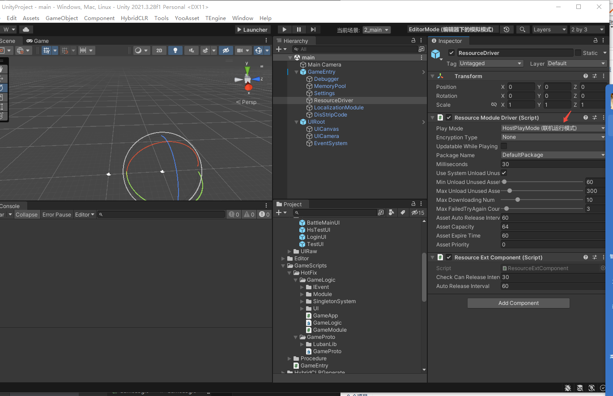
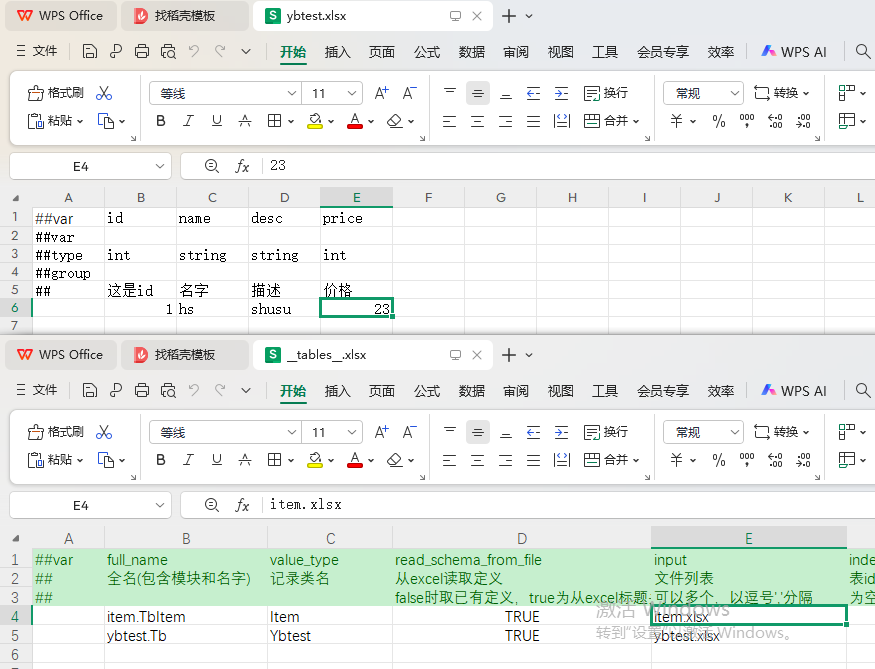

# TE-Fantasy
基于TEngine框架 游戏开发
# 说明目录 
[URL在线转换](https://www.toolhelper.cn/EncodeDecode/Url?type=1)
[大小写转换](https://app.xunjiepdf.com/yinwen)
- [快速开始使用](#%E5%BF%AB%E9%80%9F%E5%BC%80%E5%A7%8B%E4%BD%BF%E7%94%A8)  
    * [打包运行](#%E6%89%93%E5%8C%85%E8%BF%90%E8%A1%8C)
    * [注意事项](#%E6%B3%A8%E6%84%8F%E4%BA%8B%E9%A1%B9)
- [导入luban](#luban)


## 快速开始使用

### 打包运行
 *   1.运行菜单 HybridCLR/Install... 安装HybridCLR，每次更新HybridCLR版本需要重新执行一次安装。
 *   2.运行菜单 HybridCLR/Define Symbols/Enable HybridCLR 运行开启HybridCLR热更新。
 *   3.运行菜单 HybridCLR/Generate/All 进行必要的生成操作。这一步不可遗漏!!!
 *   4.运行菜单 HybridCLR/Build/BuildAssets And CopyTo AssemblyPath，生成热更新dll并copy到热更程序集中。
 *   5.运行菜单 YooAsset/AssetBundle Builder 构建AB。
 *   6.打开Build Settings对话框，点击Build And Run，打包并且运行热更新示例工程。
### 注意事项
* 打包时需要打包的模式在 main 场景 ResourceDriver 下修改模式
  

* 修改热更新服务器地址 在TEngine 下的 settings 修改


* 之后的热更新，如果修改了代码，需要进行步骤4，如果修改了ab包(资源，预制体等待)则需要进行步骤6

## LuBan
* 下载[luban](https://github.com/focus-creative-games/luban.git) 到TEngine同一目录下   


* 点击Tools下的bat文件  


* 新建表，添加表配置


* 在TEngine下转表 会在GameProto下生成文件 注意ConfigSystem现在不会生成(原因是运行的bat不一样，需要去运行图8中的bat)  


* 最后在GameApp中测试，测试代码如下
```c#
 ConfigSystem.Instance.Load();
        foreach (var item in ConfigSystem.Instance.Tables.Tb.DataMap)
        {
            Log.Debug(item.Value.Id + " |" + item.Value.Desc);
        }
```

## MySQL测试 out
1. 报错Client does not support authentication protocol requested by server; consider upgrading MySQL client 解决方法：cmd运行mysql 输入指令
`ALTER USER 'root'@'localhost' IDENTIFIED WITH mysql_native_password BY '123456';`
`FLUSH PRIVILEGES;`
2. 报错KeyNotFoundException: The given key 'utf8mb4' was not present in the dictionary. 解决方法：更换MySql.Data.dll
点击链接 [Mysql.Data.dll](https://cn.dll-files.com/mysql.data.dll.html) 重新下载驱动包，下载第三个然后解压进行替换即可

## MongoDB
1. 下载MongoDB 和 MongoDBshll [教程](https://blog.csdn.net/tell_me_why0/article/details/139521305)
2. [使用方法](https://www.runoob.com/mongodb/mongodb-dropdatabase.html)

### MongoDB主要用法
```c#
//创建数据库 use hsgamedb
//删除数据库 db.dropDatabase
//创建集合（表）db.createCollection("gameLogin")
//删除集合 db.gameLogin.drop()
//集合插入数据 db.gameLogin.insertOne({username:"hs",password:123456})
//查看数据库 show dbs
```
unity 连接mongoDB 示例在[LoginUI.cs](./TEngine/UnityProject/Assets/GameScripts/HotFix/GameLogic/UI/LoginUI/LoginUI.cs)中


## YooAsset打包问题，ab包有问题导致图片不显示，场景等物体变紫色
1. 把图片等资源删除，重新加载进来，新建换一个目录，在yooasset中设置好重新打包。
2. 场景等物体删除在重新打包

## 网络模块 没有 测

## Socket
[服务器](./GameLoginServer/ServerLearn/ServerLearn/Form1.cs)  

[客户端](./GameLoginServer/ClientTest/ClientTest/Form1.cs)

