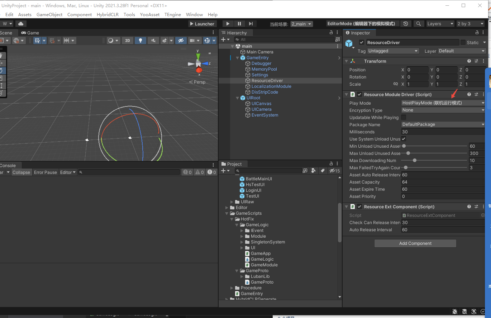
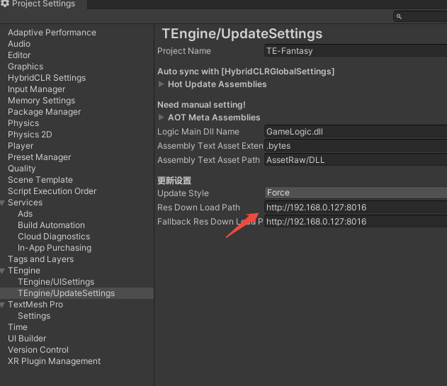

# TE-Fantasy
基于TEngine框架 游戏开发
# 说明目录 
[URL在线转换](https://www.toolhelper.cn/EncodeDecode/Url?type=1)
[大小写转换](https://app.xunjiepdf.com/yinwen)
- [快速开始使用](#%E5%BF%AB%E9%80%9F%E5%BC%80%E5%A7%8B%E4%BD%BF%E7%94%A8)  
    * [打包运行](#%E6%89%93%E5%8C%85%E8%BF%90%E8%A1%8C)
    * [注意事项](#%E6%B3%A8%E6%84%8F%E4%BA%8B%E9%A1%B9)

## 快速开始使用

### 打包运行
 *   1.运行菜单 HybridCLR/Install... 安装HybridCLR，每次更新HybridCLR版本需要重新执行一次安装。
 *   2.运行菜单 HybridCLR/Define Symbols/Enable HybridCLR 运行开启HybridCLR热更新。
 *   3.运行菜单 HybridCLR/Generate/All 进行必要的生成操作。这一步不可遗漏!!!
 *   4.运行菜单 HybridCLR/Build/BuildAssets And CopyTo AssemblyPath，生成热更新dll并copy到热更程序集中。
 *   5.运行菜单 YooAsset/AssetBundle Builder 构建AB。
 *   6.打开Build Settings对话框，点击Build And Run，打包并且运行热更新示例工程。
### 注意事项
* 打包时需要打包的模式在 main 场景 ResourceDriver 下修改模式
  

* 修改热更新服务器地址 在TEngine 下的 settings 修改
